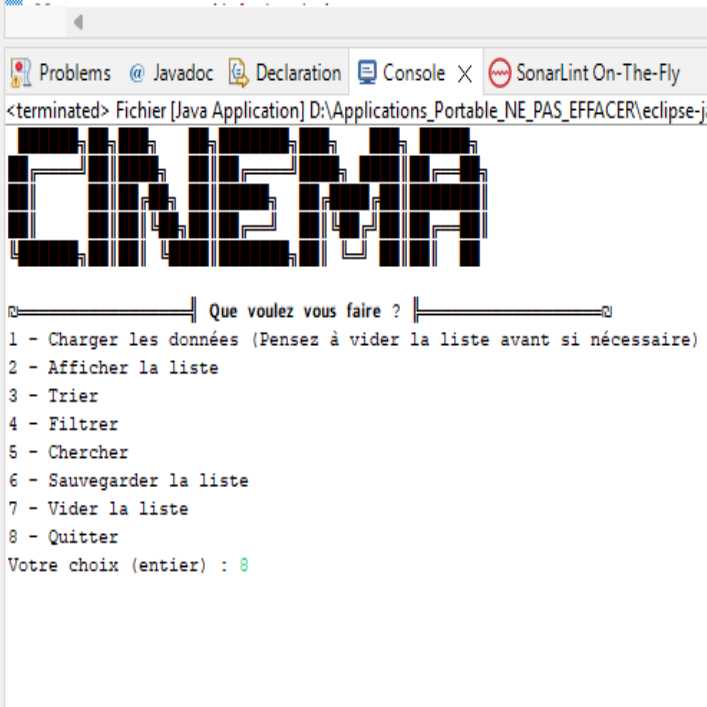

# Cinema

## Résumé du projet

### Contexte 
Ce projet a été réalisé en cours lors d'une SAE (Situation d'Apprentissage et d'Évaluation), nous devions réaliser une interface en JAVA permettant d'interpréter des fichiers contenant des films afin de les trier, les filtrer, les sauvegarder... Grâce à cela, nous pouvions réaliser des graphes de comparaisons entre les différents tris (par exemple) et les différences entre ArrayList et LinkedList.

## Contributeurs :
- [Lucas (Moi)](https://github.com/Speeckby)
- [Alexandre](https://github.com/Taksy01)
 